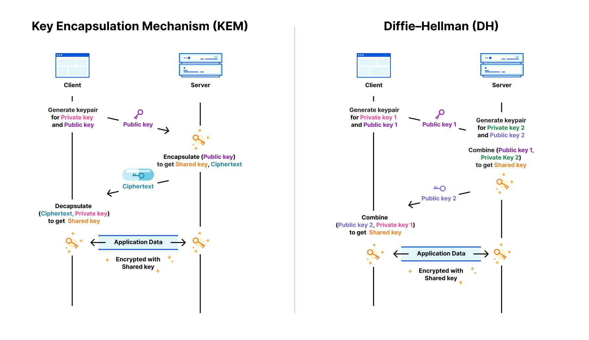

Minecraft 在多人游戏中使用混合模式加密（非对称+对称加密）已经十余年了，而这套加密算法在这十余年间本质上从未有过更改，只是数据包格式略有变动。[wiki.vg 上对这一加密算法有非常详细的介绍](https://wiki.vg/Protocol_Encryption)，两年前我开始研究 Minecraft 多人游戏协议时借助 wiki.vg 和 Fnardn 的帮助才粗略地将其理解下来，而后的两年里我在密码学应用领域陆陆续续经历了不少实践，对该协议有了更多的看法，遂意动写下此文。后续可能会对此文进行进一步纠正，还请各路大神在评论区斧正。

## 协议概要

以下内容摘自 wiki.vg:

> The login process is as follows:
>
> C→S: Handshake with Next State set to 2 (login)  
> C→S: Login Start  
> S→C: Encryption Request  
> Client auth  
> C→S: Encryption Response  
> Server auth, both enable encryption  
> S→C: Set Compression (optional)  
> S→C: Login Success  
> C→S: Login Acknowledged

客户端在向服务端发送自己的游戏名（IGN）后，如果服务器启用了正版验证，会立刻向客户端发送加密请求。这个请求通常包含一个服务器 ID，一个以 ASN.1 DER 格式编码的 1024bit RSA 公钥，以及一个随机生成的验证口令。服务器 ID 和验证口令用于双方向 Mojang 服务器进行身份验证时确保会话的唯一性，防止中间人攻击。RSA 公钥则用于进行[密钥封装（KEM）](https://en.wikipedia.org/wiki/Key_encapsulation_mechanism)，以交换一个 AES-128-CFB8 密钥。

由于与 Mojang 验证服务器的通信基于 HTTPS，故整个加密算法实际上由承载 HTTPS 的 TLSv1.2 或 TLSv1.3 加密通信协议提供信任层面的支持。由于 TLSv1.2 及以上的版本通常认为是密码学安全的，故整个 Minecraft 加密模型理论上没有太大的信任问题。然而，由于此算法发明于十余年前，许多被选用的密码算法都存在破绽，导致加密模型本身存在不安全因素。

总览全算法，使用到的密码学标准算法有：RSA （PKCS1v1.5 加密，1024位或以上）、AES （128位长度，CFB8 流密码)、SHA-1

## 重要因素

### RSA 长度过短

wiki.vg 在介绍中强调了以下几句话：

> The server generates a 1024-bit RSA keypair on startup.

> It is also possible for a modified or custom server to use a longer RSA key, without breaking official clients.

服务器在启动时生成一对 1024bit RSA 密钥。这样的设计可能出于两个原因：

1. RSA 密钥生成速度很慢。在不同的 CPU 上，一对 1024bit RSA 密钥的生成需要花费5秒到50秒不等。如果是 2048bit RSA 密钥，则需要10秒以上的时间。对于有大量玩家同时连入的情况，这样的开销显然是不切实际的。
2. 在当时（2012），1024bit RSA 的使用仍未被视为不安全。

即使 NIST 已于 2011 年发表文章宣布在 2011 年开始 1024bit RSA 应弃用，且在 December 31, 2013 之后完全停止使用（参考 [NIST Special Publication 800-131A](https://nvlpubs.nist.gov/nistpubs/legacy/sp/nistspecialpublication800-131a.pdf)），但 Mojang 依然这样做了。

不过值得庆幸的是，ASN.1 DER 封装格式的使用使其同时能兼容 2048bit 的 RSA 密钥，并且不会破坏各版本的客户端兼容。故升级到 2048bit RSA 密钥实际上没有太大阻力，只是可能出于上面第一条因素的考虑，这方面的更改依旧没有被实施。据实测，Hypixel 依旧使用 1024bit RSA 密钥，但是与 wiki.vg 描述不同的是，每次连接 Hypixel 收到的公钥并不相同。他们可能为每个连接生成了不同的密钥，或者准备了一个密钥池以轮换密钥。

除 1024bit RSA 已被认为不安全以外，实际上目前大部分非对称加密算法都被认为容易受到量子攻击。NIST 认为当前互联网上的绝大多数流量在数十年后都能被解密，无论是 RSA，NIST ECC 曲线还是 25519 曲线都难逃量子攻击。因此，可以肯定的是，这一协议会在十年内被更新。

### RSA PKCS#1 v1.5 加密不安全？

在 KEM 过程中，该协议使用 RSA PKCS#1 v1.5 定义的方法对通讯密钥进行加密传递。然而，这又是一个被认为不怎么安全的加密算法。在 Go 官方 RSA 标准库的文档中，就有这样一个[贴心的提示](https://pkg.go.dev/crypto/rsa#EncryptPKCS1v15)：

> WARNING: use of this function to encrypt plaintexts other than session keys is dangerous. Use RSA OAEP in new protocols.

此算法用于加密除会话密钥意外的内容都是危险的，如果这样做，则考虑选用 RSA OAEP 加密算法——一个复杂但是不容易导致错误使用的填充非对称加密算法。然而，Minecraft 确实使用 PKCS# v1.5 用于加密通讯密钥，以及验证口令，且这两者都是恒定长度。

RSA PKCS#1 v1.5 并非不安全，只是很容易因为错误的使用或者应用设计而导致不安全。换句话说，取决于使用者。目前来说，我认为 Minecraft 此处的使用是安全的，但仍缺少密码学论证。

### AES-128-CFB8

相对于非对称加密体系，对称加密体系的坑显然就没有这么多且严重。AES 暂时被认为未受到严重量子威胁，并且 128 位的 AES 密钥是安全的（Cloudflare CDN 还将 AES-128-GCM 的优先级设置高于 AES-256-GCM）。AES 是分组密码（block cipher，也称块密码），为了方便在程序中使用，通常配合一种分组密码操作模式算法将其转换为流密码（stream cipher）或者 AEAD 密码。由于当时（2012） AEAD 尚未兴起，Mojang 选择 CFB8 将其作为流密码也是情有可原，甚至还能体现出他们的谨慎。

CFB8 是[CFB 分组密码操作模式](https://en.wikipedia.org/wiki/Block_cipher_mode_of_operation#Cipher_feedback_(CFB))的一个变种，在维基上有较为详细的介绍。CFB 和 CTR 是最受欢迎的两种能将块密码转换为流密码的算法，相较于 CTR 在并行加解密方面的极大优势（速度极快），CFB 则提供错误传播（error propagation）方面的优势。在遭遇到部分密文在传输过程中被篡改的情况时，CFB 会使一个块长度之后的所有解密操作都返回完全错误的结果，从而迫使上层应用察觉并报错。而 CTR 则通常只会使出错的密文解密出错，后面的密文则能正常解密，使攻击者对特定内容进行篡改的成功率大大提高。

CFB8 继承了 CFB 在错误传播方面的优势，并将位宽降至一个字节的大小。相较于 CFB，CFB8 在遭遇单个字节密文遭遇篡改后，后续所有字节的密文都会立即解密为完全错误的结果。乍一看似乎更加安全，实际上 CFB8 这样做带来的开销是巨大的。CFB 能将底层块密码输出的每一个字节用于加密，但 CFB8 无论底层块密码一次性能输出多少个字节，都永远只拿第一个字节用于加密，并使用一种难以优化的变换形式将密文反映到其状态中。这是一种极大的性能浪费。以 AES 为例，AES 块密码一次能加密 16 个字节明文，而 CFB8 只用其第一个，这样粗算，其速度就只相当于 AES 块密码的 1/16。因此，我之前经常抱怨 Mojang 的选择过于保守，选择了一个并不怎么热门且难以优化的流密码算法。我也在今年对 [Tnze/go-mc](https://github.com/Tnze/go-mc) 中的 CFB8 实现进行了两次优化（[#256](https://github.com/Tnze/go-mc/pull/256) [#265](https://github.com/Tnze/go-mc/pull/265)），实现了多场景加速以及解密并行化，在直接使用其框架（bot 包/server 包）时加密速度提升 ~20%，解密速度提升 30%~200%，视 CPU 和内存情况而定。

再谈谈 AES。AES 是最被广泛使用的对称加密块密码，安全性得到广泛证明，包括电脑、手机、电视甚至智能穿戴设备在内的现代主要在用 CPU 都已添加 AES 硬件加速指令集的支持。Minecraft 所使用的 Java 标准库实现支持 AES 硬件加速。故对 AES 的选择无可挑剔。

### SHA-1

SHA-1 已被认为不安全并且易于破解。同样在上面的那篇 NIST 文章中（[NIST Special Publication 800-131A](https://nvlpubs.nist.gov/nistpubs/legacy/sp/nistspecialpublication800-131a.pdf)），NIST 同时宣布了对 SHA-1 的弃用。然而，在这篇文章中提到，对于“非数字签名生成应用程序”（non-digital signature generation applications）中，SHA-1 的使用仍然是“可接受”（acceptable）的。在 2022 年底的时候，NIST 又[发出倡议](https://www.nist.gov/news-events/news/2022/12/nist-retires-sha-1-cryptographic-algorithm)，将 December 31, 2030 作为弃用 SHA-1 的最后期限。

不过，即使 Minecraft 使用 SHA-1 计算验证口令和会话信息的摘要值，它并不是安全模型的一部分。也就是说，Minecraft 中的这个使用场景即为上述的“非数字签名生成应用程序”。生成的摘要值都经过加密传输，仅对客户端、Mojang 服务器以及连接对端（在被中间人攻击时为中间人端）可见。而被摘要的内容中不包含敏感信息，中间人也只能拿到他已经知道的东西，即使被破解了也无需担心（虽然谁都不想被这样做😶）。

注：此文中的“验证口令”并非“Minecraft 账户访问口令（access token）”，而是该加密协议中的 verify token。

尽管如此，SHA-1 的使用也应该被替换。对于所有的密码学应用，我都会推荐 SHA-256（实际上是 SHA-2 256）和 BLAKE3。SHA-256 已受到大部分硬件的硬件加速支持，速度快且饱经考验，但可能会遭受[长度扩展攻击（length extension attack）](https://en.wikipedia.org/wiki/Length_extension_attack)。BLAKE3 是一个较新的算法，衍生于 SHA-3，但运算速度极快，据官方说法甚至可以超越 SHA-1 和 MD5 等经典算法，它免疫长度扩展攻击，并且有灵活可自定义的输出长度。

有趣的是，尽管 SHA-1 被认为不安全，HMAC_SHA-1 的组合仍被认为安全。设计于 2017 年的 Shadowsocks AEAD 协议仍然使用 HKDF_SHA-1 算法来获得一个会话通讯密钥。不过这些仍被认为安全的组合也会在 NIST 的 2030 期限后淘汰，Shadowsocks 2022 Edition 协议中也将密钥派生函数换为了 BLAKE3 KDF。

## 如果是我

自嗨环节。如果换做我在现在为 Minecraft 设计一个加密通讯协议，我会怎么做？在此提供一些在这方面的改进参考。

### 使用 ECDH 代替 RSA KEM

混合加密体系中，有两个使用非对称加密算法交换对称加密通讯密钥的算法家族。一家是 Minecraft 正在使用的 KEM，另一家是 TLS 主要正在使用的 [DH（迪菲-赫尔曼密钥交换，Diffie–Hellman key exchange）](https://en.wikipedia.org/wiki/Diffie%E2%80%93Hellman_key_exchange)。这两者看似做法不同，其实差别不大，毕竟都是为了同一个目的。Cloudflare 博客中有一幅图形象地对比了两类算法运作的差异：【[图片出处](https://blog.cloudflare.com/post-quantum-for-all/)】

需要补充的是，Minecraft 通信加密协议中客户端和服务端的身份与此图中 KEM 所描述的正好相反。

ECDH 是使用椭圆曲线加密算法的 DH。相较于 RSA KEM，ECDH 有速度、大小等各方面的优势。目前最流行的 ECDH 算法 X25519，公私钥都只有 32 字节大小，生成私钥的过程仅是生成一组 32 字节的随机数（在实际应用中还需进行简单的三次位修改，以避免更大运算量并保证常量时间运算），密钥交换运算速度远快于 RSA，是非常理想的密钥交换算法。

在修改中，只需将 1024bit RSA 简单替换为 X25519 即可。同时将验证口令改为随机生成的盐值，使用 BLAKE3 KDF 或者 HKDF_SHA-256 将盐值与 X25519 的输出派生出实际使用的通讯密钥（因为[部分密码学家建议将 X25519 的输出经过密钥派生后再使用](https://man.openbsd.org/X25519.3)）。这项更改还能顺便节省每次握手时数十字节的流量开销。

X25519 也受到量子威胁，在十年后应被更换。目前 NIST 等机构正在开发一个后量子算法 Kyber，预计在 2024 年标准化。不过，Kyber 需要传输的数据量非常大，每次握手都需要传输 800 字节或更多的数据，甚至超越 TCP MSS。尽管 Kyber 比 X25519 更快，但传输大小是它的一个重大痛点。

### 使用 AEAD

上面介绍了流密码体系，也提到了 AEAD。当初 Mojang 如此小心谨慎地选择 CFB8 来将安全性落实到每一个字节，要是他们早点选择 GCM 就没这事了。[GCM](https://en.wikipedia.org/wiki/Block_cipher_mode_of_operation#Galois/counter_(GCM)) 是一种分组密码操作模式，与 CFB/CTR 不同的是，它将块密码转换为 AEAD 密码。AEAD 密码以一个消息为单位进行加解密，每次被传入加密的内容被视为一整个消息，解密时也需要将一整个消息不多不少地传入。由于 GCM 模式可以被看作是 CTR 模式与 GMAC 的组合，GCM 可以提供类似于 CTR 的并行加解密效率，同时保证消息不被篡改。在有内容被篡改时，函数会直接返回错误，比流密码中的错误扩散处理方式更为优雅。现代的 CPU 也有 SIMD 指令可以实现对 GMAC 的加速，整体加解密性能直逼 CTR，加密时远超 CFB。因此，我会选择使用 AES-128-GCM 用于加密。这也是 TLS 等一众密码协议的首要选择。

应用 AEAD 密码则需要对加密传输协议进行修改。原先使用的流密码，因为流密码本身没有开销且没有其他限制，只需简单地将输入输出流替换为加密流即可。由于 AEAD 对长度敏感（因为要确保是一整个消息），所以还需要对格式进行修改。Minecraft 通信协议中已有“包”的概念，并且在每个包前面附加上一个 VarInt 编码的包长。我们要做的是将这个包长改为明文发送，然后再将加密后的“数据包”发送出去。接收方需要做的是先明文读入包长，然后再读入包长+AEAD Overhead个字节，将这些内容送入 AEAD 解密函数，即可获得明文。

你可能怀疑，使用明文发送包长会不会导致不安全性。实际上，TLS 就在这么做。即使不明文发送包长，攻击者也可以通过各种细节得知你实际的包长度，这一点需要很大的代价才能在实践中避免。因此，TLS 就选择不隐藏包长，因为仅仅为这一包长数字单独加密一次或者实现完整的长度混淆机制显得得不偿失，并且没有太大实际意义。至于 Shadowsocks AEAD 以及以后版本为什么会选择对包长进行单独的一次 AEAD 加密，是因为 Shadowsocks 的设计目标就是让传输流量从头到尾看起来都完全随机，不留下数据层面的线索，而明文的包长很显然暴露了它所对应的协议。TLS 和 Minecraft 通讯协议在握手部分都有明文内容，若要辨别它们对应的协议，也无需通过识别明文发送包长这一特征来做到。

## 向 Mojang 提议

事实上，我在今年6月的时候就尝试向 Mojang 提议更新他们的加密协议（甚至通讯协议），并且提出了类似上面的建议。出于他们反馈系统的字数限制，当时所写远远没有如上那么详细，但也概括了主要精神。现在，这一反馈贴已经通过审核，欢迎大家前去投票支持我的提议，也可以提出其他建议，这会对 Minecraft 社区的长期发展产生深远的影响！😊

链接： https://feedback.minecraft.net/hc/en-us/community/posts/17001695944077-Improve-Minecraft-encryption-protocol
