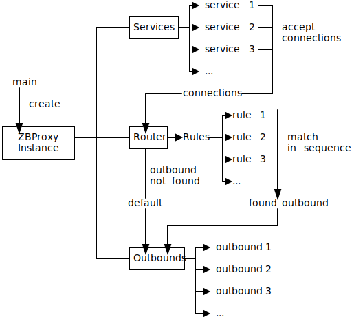

# Structure

This image simply shows the structure and working principle of ZBProxy.

## Components

### Instance

Instance is a hub of all parts of ZBProxy, with responsibility for initializing and reloading.

It will also listen to configuration update events and notify all parts to reload.

### Services

Services works as a inbound listener.
It accepts the connection and does some early processing, such as socket options and IP access control,
and then passes them to router.

Every connection has a metadata, which contains all its information such as target address and protocol details.

You can also use legacy fields, which turn service into a combination of a service and an outbound.
All connections from legacy service will not go to router and simply go to its own inner outbound,
which has name prefix "legacy-".

### Router

Router is the core part of the ZBProxy. It accepts connections from services, and handles them by rules.

There are many types of handle: (ordered)

#### Sniff

Sniff protocol from the connection.

This doe not change anything, but will get information from data transferred through the connection,
and save them to the connection metadata.

This is neccessary since most protocol-related rules and outbounds require a protocol metadata,
which is only available from sniffing.
Make sure that the connection is sniffed before some protocol-related operations.

#### Rewrite

Rewrite connection metadata.

This is useful when you want to redirect connection by rule.

Rewritable fields include basic information (like target address) and some protocol-related information (require sniffing).

See documentation for more details.

#### Outbound

Let the connection jump to the outbound immediately.

The connection will back to the rule matching process if the outbound is not specified.

If no outbound is specified even after checking all rules, the connection will go to the default outbound set by the router.

The default default outbound is a system dialer.

### Outbounds

Outbound accepts connections from the router and does final processing.

Some protocol-related outbounds, such as Minecraft, have special responses to connections.

For example, the Minecraft outbound will respond MOTD to client and close the connection after responding.

Otherwise, the connection is expected to be relayed to the target.
