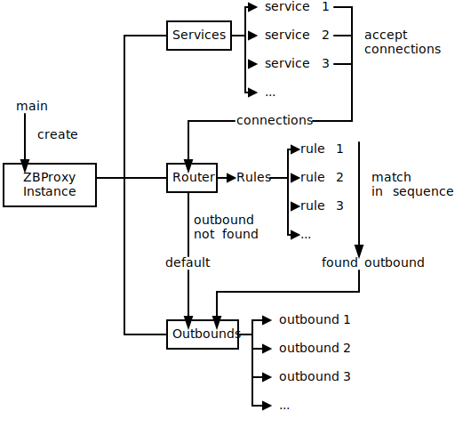

# 结构

此图简单展示了 ZBProxy 的结构和工作原理。

## 组件

### Instance

实例是 ZBProxy 各部分的枢纽，负责初始化和重新加载。

它还会监听配置更新事件并通知所有部分重新加载。

### Services

服务充当入站监听器。
它接受连接并进行一些早期处理，例如套接字选项和 IP 访问控制，
然后将它们传递给路由器。

每个连接都有一个元数据，其中包含其所有信息，例如目标地址和协议详细信息。

您还可以使用旧字段，将服务变成服务和出站的组合。
来自旧服务的所有连接都不会转到路由器，而只会转到其自己的内部出站，
其名称前缀为“legacy-”。

### Router

路由器是 ZBProxy 的核心部分。它接受来自服务的连接，并按规则处理它们。

句柄有很多种类型：（有序）

#### Sniff

从连接中嗅探协议。

这不会改变任何东西，但会从通过连接传输的数据中获取信息，
并将它们保存到连接元数据中。

这是必要的，因为大多数与协议相关的规则和出站都需要协议元数据，
而这只能通过嗅探获得。
确保在某些与协议相关的操作之前嗅探连接。

#### Rewrite

重写连接元数据。

这在您想要通过规则重定向连接时很有用。

可重写的字段包括基本信息（如目标地址）和一些与协议相关的信息（需要嗅探）。

有关更多详细信息，请参阅文档。

#### Outbound

让连接立即跳转到出站。

如果未指定出站，连接将返回到规则匹配过程。

如果即使检查了所有规则后仍未指定出站，则连接将转到路由器设置的默认出站。

默认的默认出站是系统拨号器。

### Outbounds

出站接受来自路由器的连接并进行最终处理。

一些与协议相关的出站，例如 Minecraft，对连接有特殊响应。

例如，Minecraft 出站将向客户端响应 MOTD，并在响应后关闭连接。

否则，连接预计将被中继到目标。
